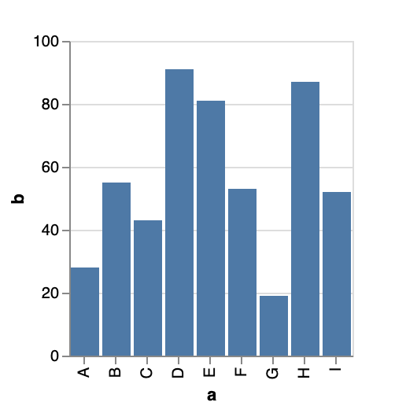
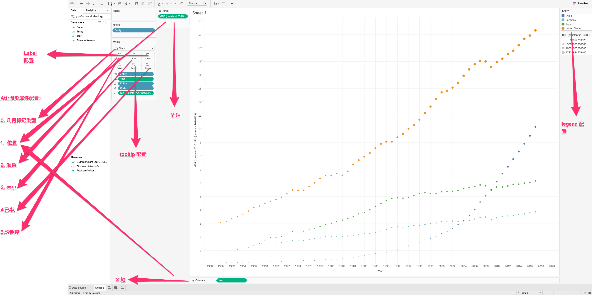

这里的数据可视化系统是指类似于 [Tableau](https://www.tableau.com/) 和 [Metabase](https://github.com/metabase/metabase) 这种可以让用户通过简单拖拽生成图表的系统。这类系统要在易用性和功能上维持一种微妙的平衡：既要用起来简单，又要功能强大；既要对小白友好，又要让专业人士满意。这篇文章不会讨论交互问题，主要提供一种构建这类系统的思路。


核心流程可以分成以下几步：

1. 用户交互生成 sql dsl 和 图表 ui dsl
2. sql dsl 生成 sql
3. 执行 sql 得到 查询结果, 合并到 ui dsl 中
4. 渲染 ui dsl 得到


#### A  JSON to SQL Translator

首先这只是一个 JSON 到 SQL 的翻译器，它有点类似于 SQL 的语法树，跟 GraphQL 之类不是同一个概念。

大概是这种形式：

```json
{                                                                                      
  table: "users",
 	condition: [{name: 'id', op: '>', value: 10}]
	fields: [
  	{name: "id", source: "users"},
		{ name: "zoneName", source: "users", alias: "zone"}
	]
}
```

生成的 sql 大概这样：

```sql
SELECT id, zoneName AS zone FROM users WHERE id > 10
```

实际比这个例子要复杂得多， `group by`, `join`, `order` , 子查询等 SQL 对应的语法基本都有。

为什么需要这种转换 ?

1. 方便从用户交互生成查询。比如用户拖入一个过滤条件，直接在这个 condition push 一个过滤条件就好了。但是如果直接操作 SQL 字符串就很麻烦，必须先 parse SQL, `WHERE` 里增加一个 `AND` 再生成 SQL 字符串
2. 抹平数据库方言间的差异。比如有的用 MySQL，有的用 Presto, 不需要总为那些方言细节操心。

#### A Visualization Grammar

数据可视化本质上是数据到图形属性的映射。*The Grammar of Graphics* 提供了刚刚好的抽象。下面是一个 [vega-lit](https://vega.github.io/vega-lite/) 的例子。

```json
{
  "$schema": "https://vega.github.io/schema/vega-lite/v3.json",
  "description": "A simple bar chart with embedded data.",
  "data": {
    "values": [
      {"a": "A","b": 28}, {"a": "B","b": 55}, {"a": "C","b": 43},
      {"a": "D","b": 91}, {"a": "E","b": 81}, {"a": "F","b": 53},
      {"a": "G","b": 19}, {"a": "H","b": 87}, {"a": "I","b": 52}
    ]
  },
  "mark": "bar",
  "encoding": {
    "x": {"field": "a", "type": "ordinal"},
    "y": {"field": "b", "type": "quantitative"}
  }
}
```

即可得到最简单的柱状图：



为什么需要这样一种 DSL ?

做这样的系统时，很自然的想法是使用一些自定义的配置字段，然后再写代码去渲染图表。在早期，这样做起来也不麻烦，但是当你要支持越来越多的图形种类和配置时，本质上，你在实现一个自己的 DSL, 但是比起基于 *The Grammar of Graphics*  的 DSL, 抽象更混乱，配置更繁琐，扩展性更差，感觉需求无穷无尽。想象一下，你要实现 [Vega-Lite Example](https://vega.github.io/vega-lite/examples/) 里所有的图表，需要自己"精心设计"多么复杂的配置，而这只是冰山一角。


但是即使如 Metabase 这样比较流行的系统，支持的图表类型也非常有限。我觉得它最大的缺点是：很多图画不出来。而 Tableau 的强大之处在于，它可以画出很多其它系统都画不出的图表，而这强大的根源就是基于 *The Grammar of Graphics* （这本书的作者以前是 Tableau 的 VP），我标注了一张 Tableau 和 G2 概念的对比图:




结合G2 的 [图形属性](https://www.yuque.com/antv/g2-docs/tutorial-attr#zvovgz) 这篇文档，可以非常清晰的看出数据到图形属性的映射。使用类似于 Vega/Vega-Lite 等基于 *The Grammar of Graphics* 的 DSL，理论上可以获得和 Tableau/G2 同样强大的作图能力。


但是文章开头我就说了要在易用性和功能上维持一种微妙的平衡，Tableau 功能虽然强大，但是学习成本也较高，甚至[有个资格证可以考](https://www.zhihu.com/question/56816019), 也有些大学课程和专门的培训班。Metabase 用起来就比较简单。